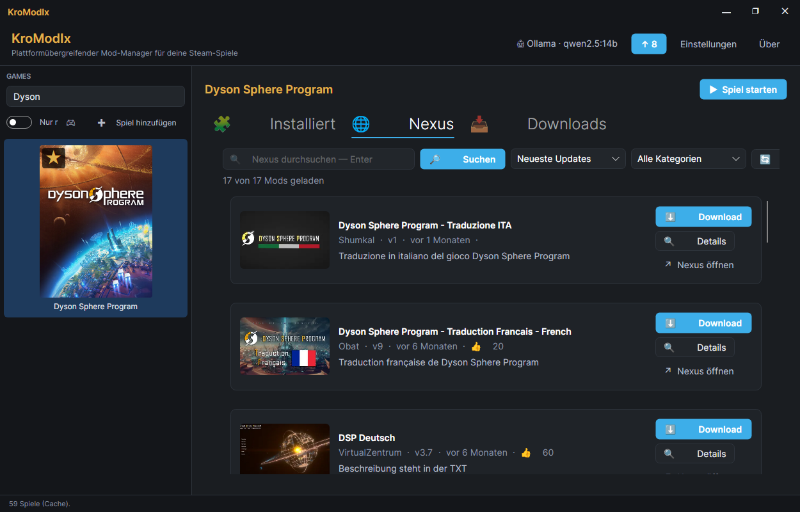

# KroModIx.Plugin.DysonSphereProgram

[](https://github.com/KroModIx/KroModIx.Plugin.DysonSphereProgram/actions/workflows/ci.yml)
[](https://github.com/KroModIx/KroModIx.Plugin.DysonSphereProgram/releases)

**Dyson Sphere Program Mod-Manager** — Plugin für den
[KroModIx](https://github.com/KroModIx/KroModIx).

Verwaltet BepInEx-Plugins für Dyson Sphere Program (Youthcat Studio,
Steam AppId 1366540). Erkennt sowohl flat DLLs als auch Ordner-Layouts
unter `BepInEx/plugins/`, Enable/Disable via `.disabled`-Suffix,
Uninstall, Bulk-Aktionen. DE+EN-Übersetzung.

## Screenshot



## Voraussetzungen

Braucht den [KroModIx-Host](https://github.com/KroModIx/KroModIx) **ab
v1.33.0** — dort sitzen der Backup-Baukasten sowie seit v0.9.0 der Archiv-
und der GitHub-Baukasten, gegen die dieses Plugin gebaut ist. Ältere Hosts
laden das Plugin nicht.

### BepInEx installieren

Das Plugin verwaltet **nur** was BepInEx bereits geladen hat — holt es aber
selbst: der Knopf im Installiert-Tab lädt die neueste stabile Mono-Fassung
(`BepInEx_win_x64_*.zip`) direkt vom BepInEx-GitHub-Release und entpackt sie
ins Game-Root. Danach DSP einmal starten, damit BepInEx sich initialisiert;
dann existiert `BepInEx/core/BepInEx.dll` und das Plugin erkennt den Install.

Wer es von Hand machen will:
[BepInEx Pack for Dyson Sphere Program](https://www.nexusmods.com/dysonsphereprogram/mods/13)
oder direkt das BepInEx-GitHub-Release, ZIP ins Game-Root.

## Features

### Installiert-Tab

- **Discovery** aller Plugins unter `BepInEx/plugins/`:

  | Layout | Beispiel | Toggle |
  |---|---|---|
  | Flat DLL | `plugins/MyMod.dll` | `MyMod.dll` → `MyMod.dll.disabled` |
  | Ordner | `plugins/MyMod/MyMod.dll` (+ configs) | Ordner-Rename → `MyMod.disabled/` |

- **Kroste-Card-Row**: Icon (🧩 oder 📁), Name, Meta (Typ · Size · Datum),
  Status-Label (aktiv / deaktiviert), Actions (Toggle, 🗑 Deinstallieren).
- **Bulk-Aktionen** mit Progress-Scope: „▶▶ Alle aktivieren" / „⏸⏸ Alle
  deaktivieren" mit Confirm-Dialog.
- **Filter-Textbox** live nach Namen.
- **📂 BepInEx/plugins/ öffnen** — direkter Sprung zum Ordner via
  Host-Shell.

### Sprachumschaltung

DE + EN. Nach Sprachwechsel im Host: Kachel neu selektieren, dann sind
die frischen Übersetzungen aktiv (Host-Tab-Cache-Invalidate seit v1.14.7).

## Nicht in v0.1 — kommt später

- **Nexus-Katalog-Tab** (v0.2): analog Cyberpunk-Muster über
  `IHostServices.Nexus`. Der User pflegt seinen Personal-API-Key
  einmal im Host-Settings-Tab „🌐 Nexus".
- **Downloads-Tab** (v0.3): eingerichteter Watch-Ordner, `.zip`-Auto-
  Extract in `BepInEx/plugins/`.
- **Update-Discovery** (v0.4): `IUpdateNotifier` für installierte Mods,
  grüner ↑-Badge auf der DSP-Sidebar-Kachel.
- **KI-Zusammenfassung** im Detail-Dialog (v0.5).

## Build

```bash
dotnet build -c Release
dotnet test
```

## Lizenz

MIT — siehe [LICENSE](LICENSE).
